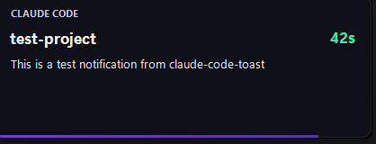

# claude-code-toast

Custom glassmorphism toast notifications for [Claude Code](https://docs.anthropic.com/en/docs/claude-code) on WSL2.

Get notified when Claude finishes a task — with project name, elapsed time, and a summary of what was done.



## Features

- **Glassmorphism design** — semi-transparent background, rounded corners, fade animations
- **Elapsed time tracking** — color-coded timer badge shows how long each task took
- **Message preview** — shows Claude's last response or notification content
- **Non-intrusive** — doesn't steal focus, click to dismiss, auto-dismiss with progress bar
- **DPI-aware** — scales properly on high-DPI displays
- **Themes** — 4 built-in themes (claude, github, minimal, midnight)
- **Configurable** — duration, position, opacity, sound, minimum elapsed threshold
- **Smart filtering** — skip notifications for quick tasks under your threshold

## Events

| Event | Behavior |
|---|---|
| `UserPromptSubmit` | Starts the timer |
| `Stop` | Shows toast with elapsed time + last message |
| `Notification` | Shows toast with notification content |

## Requirements

- **WSL2** on Windows 10/11 (Windows 11 recommended for rounded corners + acrylic)
- **[Bun](https://bun.sh)** runtime
- **PowerShell** (available by default via `powershell.exe`)

## Install

```bash
git clone https://github.com/flaviomartil/claude-code-toast.git
cd claude-code-toast
chmod +x install.sh
./install.sh
```

The installer:
1. Adds hooks to `~/.claude/settings.json`
2. Creates default config at `~/.claude/ccnotify/config.json`
3. Shows a test notification to confirm it works

Restart Claude Code after installing.

## Uninstall

```bash
cd claude-code-toast
chmod +x uninstall.sh
./uninstall.sh
```

Your config is preserved at `~/.claude/ccnotify/config.json`.

## Test

```bash
bun src/notify.js --test
```

## Configuration

Edit `~/.claude/ccnotify/config.json`:

```json
{
  "duration": 6,
  "position": "bottom-right",
  "minElapsed": 5,
  "theme": "claude",
  "opacity": 0.92,
  "sound": {
    "enabled": true,
    "file": null
  }
}
```

| Option | Type | Default | Description |
|---|---|---|---|
| `duration` | number | `6` | Seconds before auto-dismiss |
| `position` | string | `"bottom-right"` | `bottom-right`, `bottom-left`, `top-right`, `top-left` |
| `minElapsed` | number | `5` | Skip notifications for tasks shorter than N seconds |
| `theme` | string | `"claude"` | Color theme preset |
| `opacity` | number | `0.92` | Window opacity (0.1 - 1.0) |
| `sound.enabled` | boolean | `true` | Play a sound on notification |
| `sound.file` | string | `null` | Path to custom `.wav` file, or `null` for Windows default |

## Themes

| Theme | Accent | Style |
|---|---|---|
| `claude` | Purple | Default — matches Claude's branding |
| `github` | Green | Dark mode GitHub feel |
| `minimal` | Gray | Subtle, neutral tones |
| `midnight` | Blue | Deep dark with amber timer |

## How it works

```
Claude Code hook event
    │
    ▼
notify.js (Bun)
    ├── Reads config.json
    ├── Checks minElapsed threshold
    ├── Calculates elapsed time
    ├── Encodes payload as base64
    │
    ▼
powershell.exe (WSL interop)
    │
    ▼
toast.ps1 (WinForms + DWM)
    ├── Resolves theme → colors
    ├── DPI scaling
    ├── DwmSetWindowAttribute for rounded corners + dark mode
    ├── DwmExtendFrameIntoClientArea for acrylic effect
    ├── GDI+ custom paint with rounded rect + gradient progress bar
    ├── Fade-in / fade-out animation
    └── Sound playback
```

The toast uses `WS_EX_NOACTIVATE | WS_EX_TOOLWINDOW` so it never steals focus. On Windows 11, it uses DWM attributes for native rounded corners and dark title bar. On Windows 10, it falls back to GDI+ rounded rectangles with opacity.

## License

MIT
